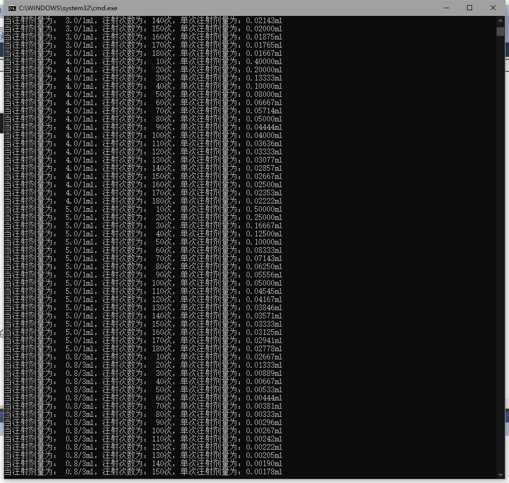

#Workspace

设计思路：利用嵌套for循环遍历不同剂量、不同注射器和不同注射次数互相搭配下的单次注射剂量。
先固定注射器型号与注射剂量，注射次数从10开始循环，到180后注射剂量增加，再次开始循环注射次数，以此类推，直到注射剂量、注射次数遍历完成，注射器型号进入下一个型号开始注射剂量与注射次数的循环，以此类推直至全部遍历结束。

部分运行结果：

9M202@%QN)`O5.png)
